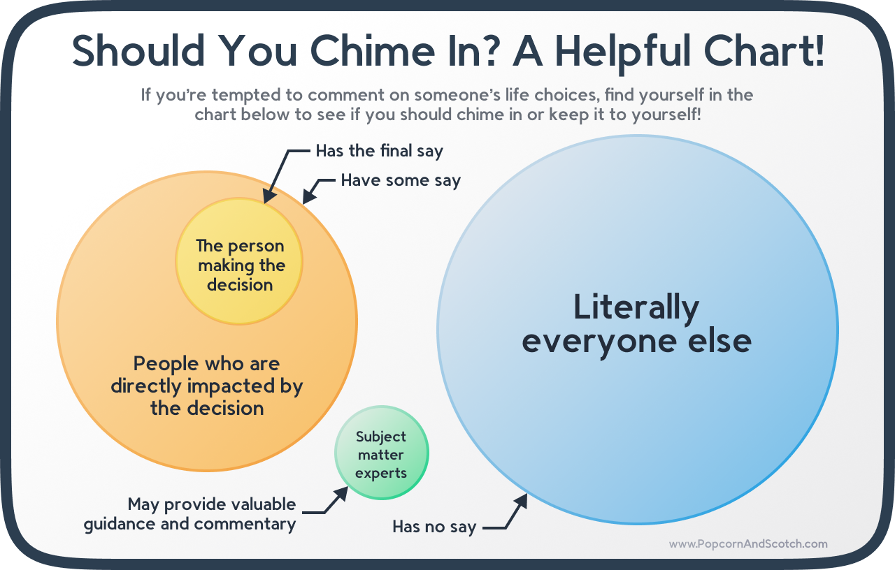

# Maybe just keep it to yourself

#### I’m not Simone Biles, and you probably aren’t either.

The furor over Simone Biles dropping out of (most of) her events at the Tokyo Olympics got me thinking.
Why does everyone feel the need to inject their opinion into everything?
Moreover, why do so many believe they have the right to be an integral part of the conversation?

I mean, I have opinions about it.
Lots of them.
Really good ones, too!
But why should she, you, or anyone else care what they are?
I’m not an athlete.
I’m not an expert on gymnastics or the Olympics.
I’m not affiliated with USA Gymnastics in any way, personal or professional.
And most important of all – full disclosure – I’m not Simone Biles herself.

{{more}}

As with most issues, the upshot is unless you’re a member of a select group, you should just keep your opinions to yourself.
That goes double if your opinion is critical or mocking.
No one benefits when uninformed abuse is added to an already fraught situation.

So, that raises an important question: How do you know if you’re part of that group?

I’m glad you asked, imaginary reader!
To make everything as straightforward as possible, I present the following informative chart:

Everyone is entitled to their own opinion, but remember that that’s all it is.
Your opinion.
If you’re not an expert or directly involved, you have no reason to expect anyone to care what it is.
In the case of Simone Biles, it’s her life, her body, her mental health, and her career.
So it’s her call.

Period.

**PS**: I recognize that this being my first entry in a blog that will consist primarily of my opinions is a ballsy move.
It may come back to haunt me.
If it does, well, that’s only fair.
All I can say is that I’ll try to stick to topics I am qualified to comment on, and provide sources when I’m not.
