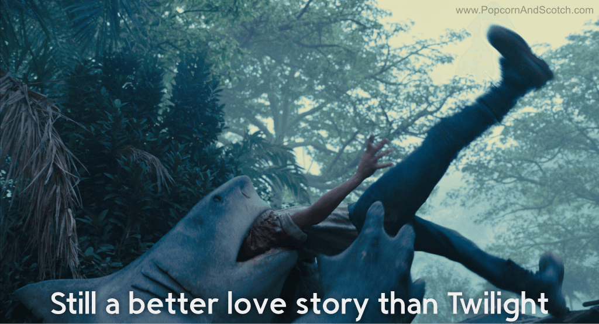
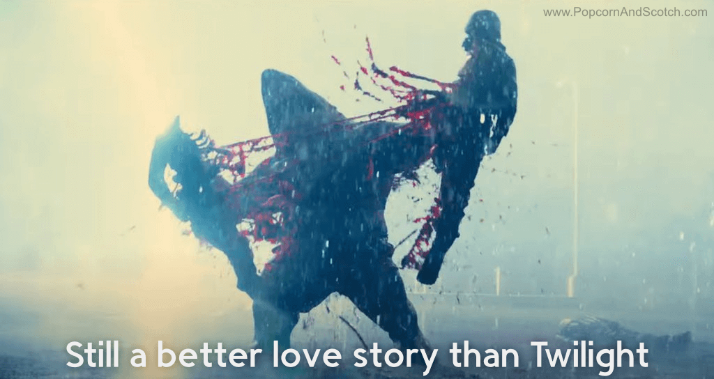

# Quick Take: The Suicide Squad (2021)

#### It’s official, Hell has frozen over.

_This is hard, but here goes:_

Against all expectations, I thoroughly enjoyed The Suicide Squad (aka Suicide Squad 2).
The first movie, Suicide Squad, was abysmally bad, so I wasn’t expecting much.
The opening scene of the sequel did have me worried.
Once it got going, though, it was irreverent, violent, chaotic, goofy, and a whole lot of fun.
Everything a Suicide Squad movie should be.

Maybe that shouldn’t be a surprise, though.
James Gunn is an old hand at these ensemble superhero movies; DC did well to lure him to the dark side.
In fact, there are many Marvel alums in this one.
Idris Elba, Michael Rooker, Taika Waititi, Sylvester Stallone, Sean Gunn, Jared Leland Gore, David Dastmalchian, Stephen Blackehart, and Steve Agee have all had some part in at least one Marvel movie.
I’ll bet I’m missing some small parts too.

I guess if you can’t beat them, hire their talent, right?

Light spoilers, and the Red Band version of the meme above, after the jump.

{{more}}

---

{>} 

I mentioned that the opening scene was worrying.
It felt like a continuation of the first movie, but I suspect that was on purpose.
Why do I say that?
Because that mission fails right off, and most of the team is immediately slaughtered.
Destroying the remnants of the first movie so viciously right off the bat can’t be an accident.

Only Flagg and Harley survive, because of course.
Flagg is the closest they have to a moral center at the start, and there’s no way they’re losing Harley Quinn in the first scene.
They did avoid pulling any male gaze shenanigans with her this time out, so that was nice.
The new characters are great as well, especially Peacemaker and King Shark (nom nom).
Bloodsport and Ratcatcher 2 get a bit sentimental at one point but otherwise make for an effective emotional core.

I expected DC to whiff it again.
I mean, honestly, who makes a sequel to such a poorly received movie?
But it worked!
And for the first time since Wonder Woman, I’m actually looking forward to a DC sequel (though, the less said about Wonder Woman 1984, the better).

> **PS**: If you’ve ever wondered what Harley Quinn’s superpower is, that’s easy: she’s insane.
> Not crazy, certainly not stupid (she _is_ a doctor, remember), but insane.
> She doesn’t exist in the same reality as the rest of us, which allows her to do things no sane person would ever attempt.
