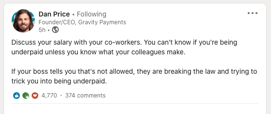
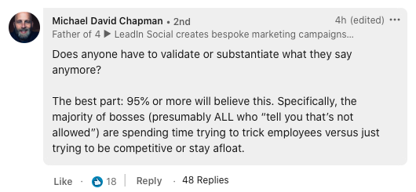
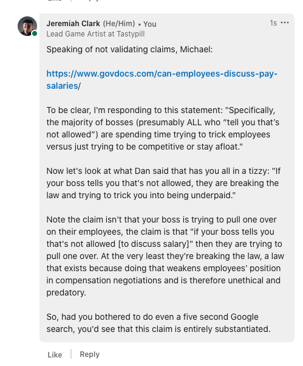
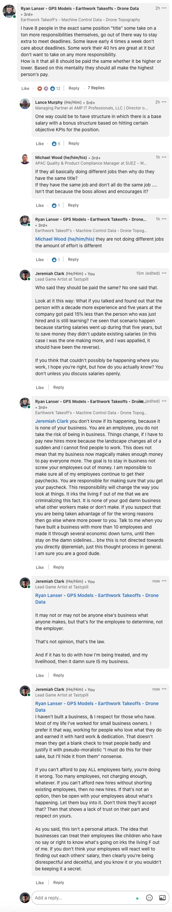

# [Go ahead talk about your salary](#DOING:-55)
<card>
Why the most common “gotcha” arguments in favor of salary secrecy are nonsense.
<!-- ON_DECK:2021-08-09T18:13:17.077Z DOING:2021-08-10T21:27:13.879Z -->
</card>

## Inspiration

## Draft 1
Why the most common “gotcha” arguments in favor of salary secrecy are nonsense.

The “You’ll only cause resentment” argument

Why do you think that? What, exactly, would cause the resentment and strife? 
Is it that people are being paid differently for the same work? 
Or because the salaries being paid are not in keeping with relative experience, skills, and market demand?  ^c6dff7

If that’s the case then everyone should be upset. If everything is on the up and up, there won’t be any issue, simple as that. 

Is the problem one or more employees who, for whatever reason, can’t handle knowing that information?

The “it’s none of your business” argument

The response to this argument depends on the source. Coming from a colleague: sure, that’s your call. Coming from a boss: Not your decision to make. That isn’t my opinion, that’s the law. In other words, if you’re the boss, then it’s none of *your* business. 

The “that’s just a part of business” argument

The “some employees work harder than others” argument

The “no one forced you to agreed to your salary” argument aka “let them eat cake”

The ”well then tell me your salary” argument 

Are you a coworker or trusted colleague? 
If not, then that’s an irrelevant question. 
If you are, I’d be happy to discuss that one on one. Nowhere did I say that you should share your salary with everyone, or that it should be broadcast online. That said, it’s totally your call. You do you. 

## Inspiration

## Draft 1
Why the most common “gotcha” arguments in favor of salary secrecy are nonsense.

### The “You’ll only cause resentment” argument

Why do you think that? What, exactly, would cause the resentment and strife? 
Is it that’s people are being paid differently for the same work? 
Or because the salaries being paid are not in keeping with relative experience, skills, and market demand? 
If that’s the case then people should be upset. 

Is the problem one or more employees who, for whatever reason, can’t handle knowing that information?

### The “it’s none of your business” argument

### The “that’s just a part of business” argument

### The “some employees work harder than others” argument

### The “no one forced you to agreed to your salary” argument, aka “if you don’t like it find another job”, aka “let them eat cake”

### The ”well then tell me your salary” argument, aka “the whataboutism”

Are you a coworker or trusted colleague? 
If not, then that’s an irrelevant question. 
If you are, I’d be happy to discuss that one on one. 