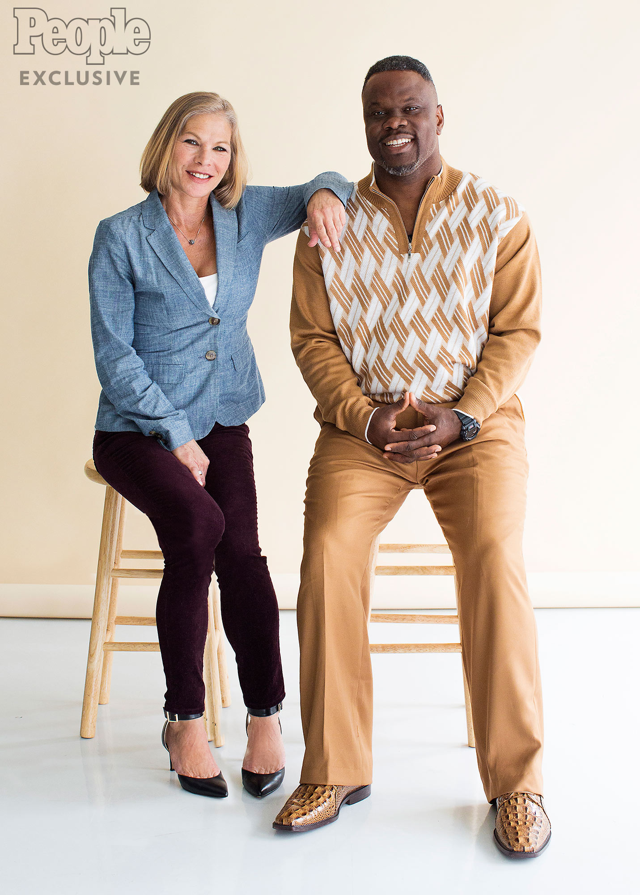

Forgiveness is a powerful thing, and can be the first step on the road to healing.
Not only for the perpetrator, but for the victim as well.
Possibly moreso.

However, it can’t be expected or demanded. A forced forgiveness is just as healing as a forced apology, it isn’t.

Ian Manuel and Debbie Baigrie

[Debbie Baigrie on Relationship with Man Who Shot Her | PEOPLE.com](https://people.com/crime/ian-manuel-released-life-post-prison-shooting-debbie-baigrie/)
